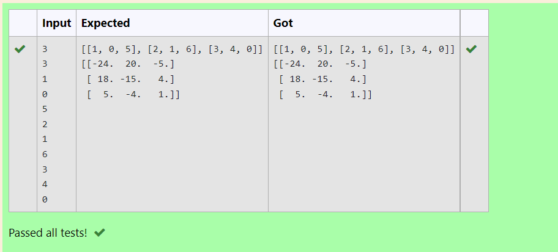

# Inverse-of-matrix

## AIM:
To write a python program to find the inverse of a nested array.

## ALGORITHM:
### Step 1:
Importing numpy module.
### Step 2:
Creating empty list named l1 and l2.
### Step 3:
Get input from user. Get rows and columns as input from user.
### Step 4:
Use nested list to append list .
### Step 5:
Print the inverse of the array using np.lingalg.inv .

## PROGRAM:
```python
import numpy as np
row,col=int(input()),int(input())
l1,l2=[],[]
for i in range(row):
    for j in range(col):
        l1.append(int(input()))
    l2.append(l1)
    l1=[]
print(l2)
arr1=np.array(l2)
arrinv=np.linalg.inv(arr1)
print(arrinv)
```

## OUTPUT:


## RESULT:
A python program to find the inverse of a nested array is written.